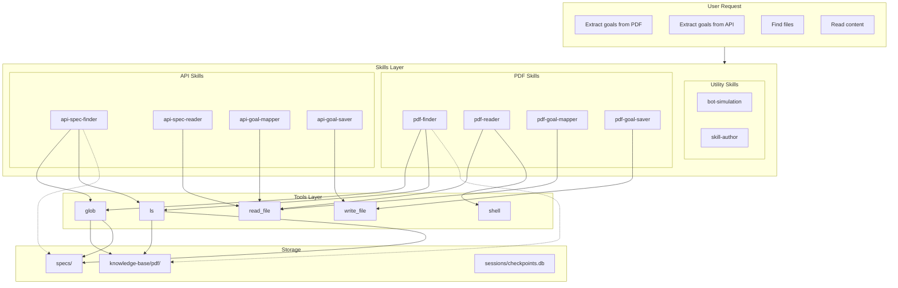
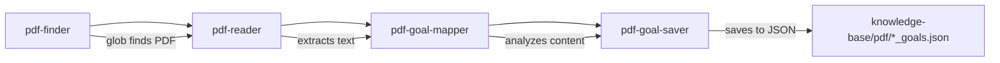
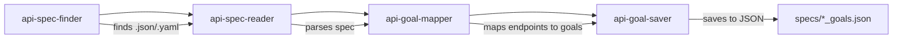
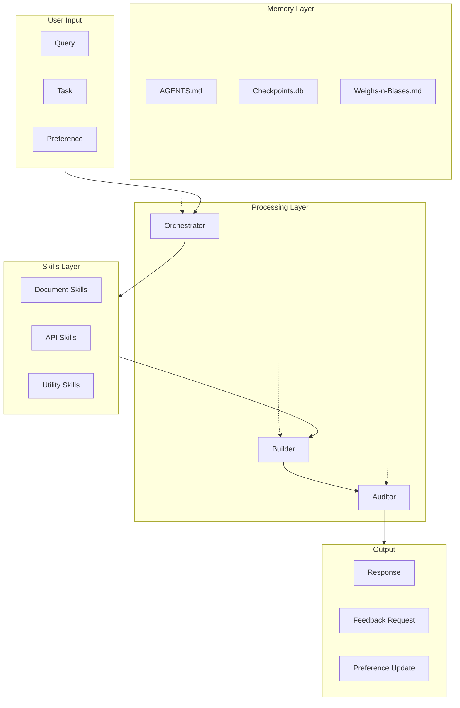
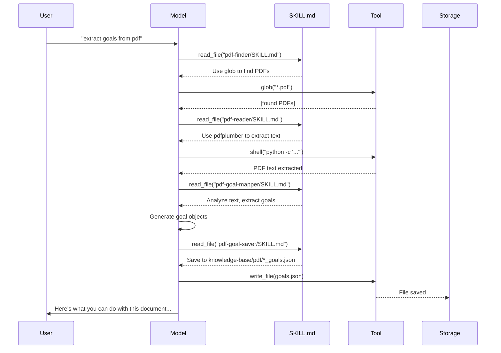

# Architecture Diagrams

## Skills Overview

```mermaid
flowchart TB
    subgraph User["User Request"]
        direction TB
        U1["Extract goals from PDF"]
        U2["Extract goals from API"]
        U3["Find files"]
        U4["Read content"]
    end

    subgraph Skills["Skills Layer"]
        direction LR
        subgraph PDF["PDF Skills"]
            PF["pdf-finder"]
            PR["pdf-reader"]
            PM["pdf-goal-mapper"]
            PS["pdf-goal-saver"]
        end
        
        subgraph API["API Skills"]
            AF["api-spec-finder"]
            AR["api-spec-reader"]
            AM["api-goal-mapper"]
            AS["api-goal-saver"]
        end
        
        subgraph UTIL["Utility Skills"]
            BS["bot-simulation"]
            SA["skill-author"]
        end
    end

    subgraph Tools["Tools Layer"]
        T1["glob"]
        T2["ls"]
        T3["shell"]
        T4["read_file"]
        T5["write_file"]
    end

    subgraph Storage["Storage"]
        KB["knowledge-base/pdf/"]
        SPEC["specs/"]
        DB["sessions/checkpoints.db"]
    end

    User --> Skills
    
    PF --> T1
    PF --> T2
    PR --> T4
    PR --> T3
    PM --> T4
    PS --> T5
    
    AF --> T1
    AF --> T2
    AR --> T4
    AM --> T4
    AS --> T5
    
    T1 --> KB
    T1 --> SPEC
    T2 --> KB
    T2 --> SPEC
    
    PF -.-> KB
    AF -.-> SPEC
```

## PDF Analysis Pipeline

```mermaid
flowchart LR
    A[pdf-finder] --> B[pdf-reader] --> C[pdf-goal-mapper] --> D[pdf-goal-saver]
    A -- "glob finds PDF" --> B
    B -- "extracts text" --> C
    C -- "analyzes content" --> D
    D -- "saves to JSON" --> E[knowledge-base/pdf/*_goals.json]
```

## API Analysis Pipeline

```mermaid
flowchart LR
    A[api-spec-finder] --> B[api-spec-reader] --> C[api-goal-mapper] --> D[api-goal-saver]
    A -- "finds .json/.yaml" --> B
    B -- "parses spec" --> C
    C -- "maps endpoints to goals" --> D
    D -- "saves to JSON" --> E[specs/*_goals.json]
```

## Greater Vision

```mermaid
flowchart TB
    subgraph Input["User Input"]
        I1["Query"]
        I2["Task"]
        I3["Preference"]
    end

    subgraph Processing["Processing Layer"]
        O["Orchestrator"]
        B["Builder"]
        A["Auditor"]
    end

    subgraph Skills["Skills Layer"]
        S1["Document Skills"]
        S2["API Skills"]
        S3["Utility Skills"]
    end

    subgraph Memory["Memory Layer"]
        M1["AGENTS.md"]
        M2["Checkpoints.db"]
        M3["Weighs-n-Biases.md"]
    end

    subgraph Output["Output"]
        O1["Response"]
        O2["Feedback Request"]
        O3["Preference Update"]
    end

    Input --> O
    O --> Skills
    Skills --> B
    B --> A
    A --> Output
    
    M1 -.-> O
    M2 -.-> B
    M3 -.-> A
```

## Skill to Tool Execution Flow

```mermaid
sequenceDiagram
    participant User
    participant Model
    participant Skill as SKILL.md
    participant Tool
    participant Storage

    User->>Model: "extract goals from pdf"
    Model->>Skill: read_file("pdf-finder/SKILL.md")
    Skill-->>Model: Use glob to find PDFs
    Model->>Tool: glob("*.pdf")
    Tool-->>Model: [found PDFs]
    Model->>Skill: read_file("pdf-reader/SKILL.md")
    Skill-->>Model: Use pdfplumber to extract text
    Model->>Tool: shell("python -c '...'")
    Tool-->>Model: PDF text extracted
    Model->>Skill: read_file("pdf-goal-mapper/SKILL.md")
    Skill-->>Model: Analyze text, extract goals
    Model->>Model: Generate goal objects
    Model->>Skill: read_file("pdf-goal-saver/SKILL.md")
    Skill-->>Model: Save to knowledge-base/pdf/*_goals.json
    Model->>Tool: write_file(goals.json)
    Tool-->>Storage: File saved
    Model->>User: Here's what you can do with this document...
```
